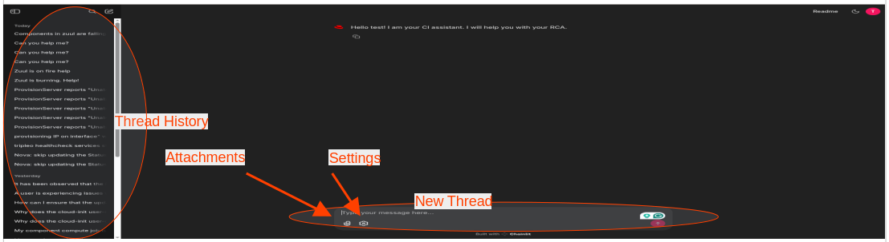
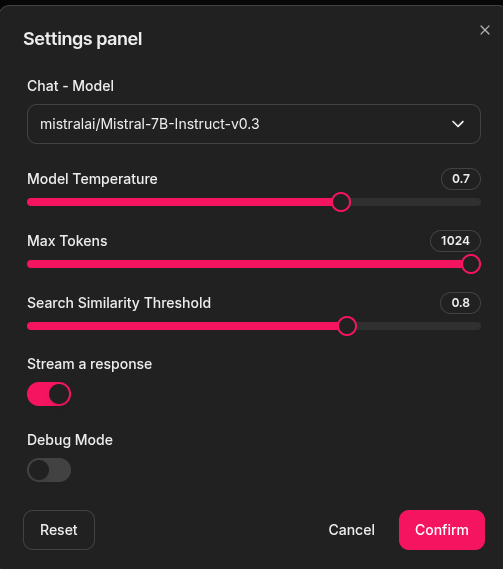

# Quickstart guide

## Explore the UI app

### Chatbot page layout

One may start a new thread or navigate to old threads. At any stage user can attaches files to the conversation (e.g. log files relevat to user inquiry).
Settings panel allows adjusment of paranmeters related to the conversation.

### Settings panel

- **Chat Model** – At this point, only one model is operational for generative LLM.
- **Model Temperature** – Variability and randomness of generated responses (close to 0 means more deterministic and focused outputs, close to 1 means more diversity by sampling from a broader range of possible answers).
- **Max Tokens** – Influences the maximum length of the response. Increasing this parameter allows the model to produce longer responses.
- **Search Similarity Threshold** – Currently uses [cosine similarity](https://en.wikipedia.org/wiki/Cosine_similarity) (cosine of the angle between two non-zero vectors in an inner product space). A threshold that is too low may yield irrelevant documents, while a threshold that is too high may exclude relevant ones.
- **VectorDB collection name** – The name of the collection in the vector database. This is where the model will search for relevant documents to answer your question.
- **Stream a Response** – Streaming a response versus waiting and printing the entire response at once.
- **Debug Mode** – Provides lots of useful information, allowing developers and users to assess the quality of the response.

## Using RCAccelerator Effectively

### Best Practices

1. **Be Specific**: Give specific details regarding the CI failure you're looking into.

   Good: "the fault 'XYZ' caused Zuul job X to fail. Please include a list of Jira tickets that may be connected to the problem.

   The phrase "My build is broken" is less useful.

2. **Include Context**: Enhance your question/query with error messages, logs and any other relevant information

3. **Ask Follow-Up Questions**: Ask clarifying questions if the first response doesn't address your problem.

### Troubleshooting

If you experience problems with RCAccelerator:

1. **Response Quality Issues**: Consider making your query more particular. Divide complicated questions into smaller, more targeted ones
   Find relevant Jira ticket to make sure RCAccelerator inventory contains details about your question.

2. **Container Startup Issues**: Obtain container logs for error messages.
